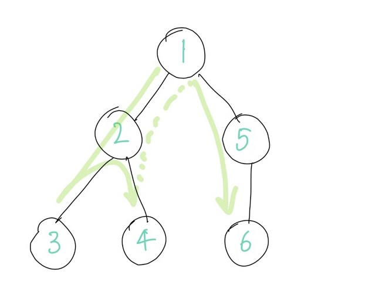
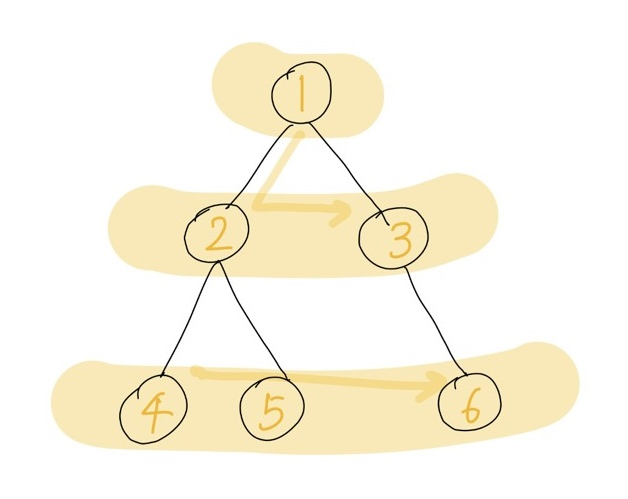

# DFS - 깊이 우선 탐색



DFS란 깊이 우선 탐색 알고리즘으로, 그래프의 깊은 곳을 우선적으로 탐색하는 알고리즘을 뜻한다. 루트노드에서부터 최대한 깊숙한 곳까지 이동한 후, 더이상 깊이 들어갈 곳이 없을 때 옆 노드들을 탐색한다.

위 그림의 그래프에 표시된 숫자는 노드가 탐색되는 순서이다.

DFS는 스택이나 재귀함수를 이용하여 구현한다.

```python
def dfs(graph, v, visited):
  visited[v] = True
  print(v)
  for i in graph[v]:
    if not visited[i]:
      dfs(graph, i, visited)

# 각 노드와 인접한 노드들의 번호를 이차원 배열로 표현.
# 인덱스 0번은 제외하고 작성.
graph = [
  [],
  [2, 5],
  [1, 3, 4],  # 2번 노드는 1, 3, 4번 노드와 연결되어 있다.
  [2],
  [2],
  [1, 6],
  [5]
]

visited = [False] * 7

dfs(graph, 1, visited)
```

# BFS - 너비 우선 탐색



BFS란 너비 우선 탐색 알고리즘으로, 루트노드와 가까운 노드들부터 탐색하는 알고리즘이다. 위 사진의 노드에 적힌 순서대로 탐색한다.

BFS는 큐로 구현한다.

```python
from collections import deque

def bfs(graph, start, visited):
  queue = deque()  
  queue.append(start)
  visited[start] = True

  while queue:
    node = queue.popleft()
    print(node)
    for i in graph[node]:
      if not visited[i]:
        visited[i] = True  # BFS는 노드를 큐에 push하는 순간에 방문 처리 해야 한다.
        queue.append(i)
    

# 각 노드와 인접한 노드들의 번호를 이차원 배열로 표현.
# 인덱스 0번은 제외하고 작성.
graph = [
  [],
  [2, 3],
  [1, 4, 5],
  [1, 6],
  [2],
  [2],
  [3]
]

visited = [False] * 7

bfs(graph, 1, visited)
```

## 문제 유형과 응용

BFS/DFS 알고리즘의 기본적인 코드에, 각 노드에서 어떤 작업을 수행할 것인지에 대한 명령들을 추가하여 문제를 해결한다.

노드와 간선이라는 개념이 분명하게 드러난 문제들뿐만 아니라, 2차원 배열 탐색 문제처럼 그래프로 바꿔 생각해볼 수 있는 문제들에서도 유용하게 사용할 수 있다. (미로찾기문제: [https://www.acmicpc.net/problem/2178](https://www.acmicpc.net/problem/2178) )

[https://devuna.tistory.com/32](https://devuna.tistory.com/32)의 3번 항목 '문제를 풀 때 DFS를 이용해야 할지 BFS를 이용할지'에 대한 글을 읽으면서, BFS/DFS문제를 풀 때 BFS와 DFS의 특성을 잘 활용해야 한다는 점을 다시 확인할 수 있었다.

> 1) 그래프의 **모든 정점을 방문**하는 문제 -> DFS/BFS 상관 없음  
> 2) **경로 자체의 특징**을 저장할 필요가 있는 문제 -> 시작지점에서 끝지점까지 one way로 가는 DFS  
> 경로의 특징의 예시로 '하나의 경로에는 같은 숫자가 적힌 노드가 있어서는 안된다'와 같은 조건이 있을 것이다.  
> 3) **최단 거리** 구하기 문제 -> BFS  
> 한 번 방문한 노드는 다시 방문하지 않으므로, 이미 빠른 경로에 의해 한 번 방문된 노드는, 느린 경로가 그 노드를 다시 방문할 수 없어서, 빠른 경로만 살아남는다.  
> 4) **그래프가 매우 크다면** DFS  
> 5) **검색 대상이 시작 지점으로부터 멀리 있지 않은 경우** -> BFS

DFS의 각 branch를 하나씩 깊숙하게 탐색하는 특성, BFS의 시작지점에서부터 가까운 모든 노드들을 확장적(?)으로 탐색하는 특성(, 그리고 한 번 방문한 노드는 다시 방문하지 않는다는 등의 규칙)을 잘 활용해야 한다는 점을 기억해두면 좋을 것 같다.